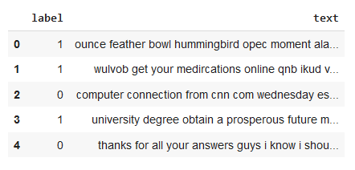

# Clasificacion-de-spam
A grandes rasgos, este proyecto pretende crear un modelo de aprendizaje supervisado que sea capaz de detectar spam en correos electrónicos haciendo uso de una base de datos encontrada en Kaggle [1]. Si realizamos un análisis exploratorio, podemos encontrar que los datos, de hecho, están bastante bien balanceados. Específicamente, tenemos un total de 43,910 entradas verdaderas o identificadas como spam y 39,538 entradas falsas o identificadas como correos legítimos, lo que da como resultado una diferencia de 4,372 entradas en cada clase de una muestra total de 83,448 entradas de correos electrónicos.

La siguiente es una muestra de como se ve la base de datos:

## Bibliografia
[1] F. Qureshi.”Spam Email | Kaggle Dataset of Spam Email.” Kaggle. Spam Email (kaggle.com) [Accessed Feb. 29, 2024]
